# Mortgage Market Power and Disparities: A Large-Scale Analysis Using HMDA Public Data

This is the final project for the MACS 30123 course *Large-Scale Computing for the Social Sciences*, completed independently by Yufei Liu. The project uses high-performance computing and machine learning to study how racial disparities in mortgage approval and pricing vary across geography and applicant characteristics.

## README Navigation

| Section | Description |
|--------|-------------|
| [Research Questions](#research-questions) | Core empirical questions |
| [Social Science Significance](#social-science-significance) | Relevance to equity and credit access |
| [Computational Challenges and Scalability](#computational-challenges-and-scalability) | Use of AWS and PySpark |
| [Data Cleaning](#data-cleaning) | Filtering, trimming, log-transforming |
| [Exploratory Analysis](#exploratory-analysis) | Summary statistics and racial gaps |
| [Modeling](#modeling) | Regression and ML estimation |
| [Presentation](#presentation) | Demo output |
| [Google Drive](#google-drive) | Data and figure access |
| [Acknowledgement](#acknowledgement) | Thanks |

---

## Research Questions

1. Are racial disparities in mortgage outcomes—approval and pricing—consistent across regions?
2. Do non-white applicants face systemic disadvantages even when controlling for income, property value, and other observables?
3. How well can machine learning models predict approval or pricing outcomes, and what do they reveal about structural disparities?

---

## Social Science Significance

This project contributes to the study of algorithmic fairness, structural inequality, and geographic variation in access to credit. The findings are relevant for housing policy, fair lending enforcement, and the design of equitable financial technologies.

---

## Computational Challenges and Scalability

- Processed over 80 million loan-level records from HMDA (2018–2023)
- Used PySpark on AWS EMR to handle large-scale preprocessing and filtering
- Dask and EC2 for parallel visualization and batch export of charts

---

## Data Cleaning

- Removed ambiguous or irrelevant `action_taken` codes
- Applied filters to remove extreme outliers in income, loan amount, and property value
- Log-transformed skewed numerical variables
- Saved cleaned dataset as `hmda_cleaned0529.parquet`

---

## Exploratory Analysis

### Interactive Rejection Rate Maps by Race
Created using Holoviews + Bokeh, colored by metro area status:
- Orange = Top 20 MSAs by loan volume
- Green = All other tracts

These maps highlight how rejection rates cluster by region and race. Native and Black applicants see concentrated rejections in the South and Midwest. Asian applicants are more present in coastal cities, but disparities persist even in urban centers.

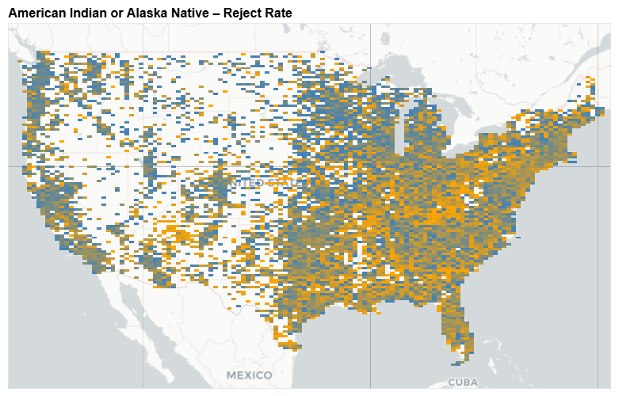
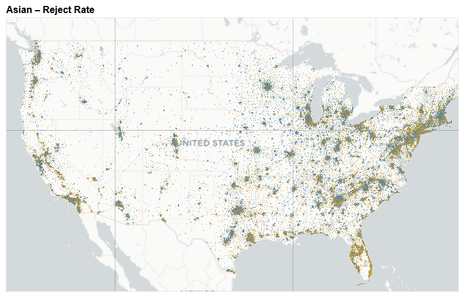
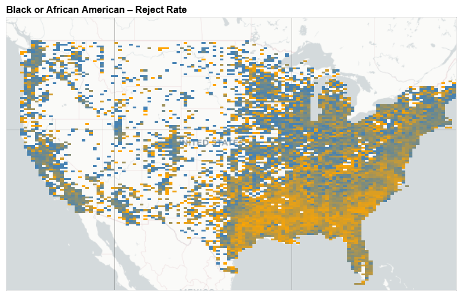

### Loan Rejection Rate by Race Over Time
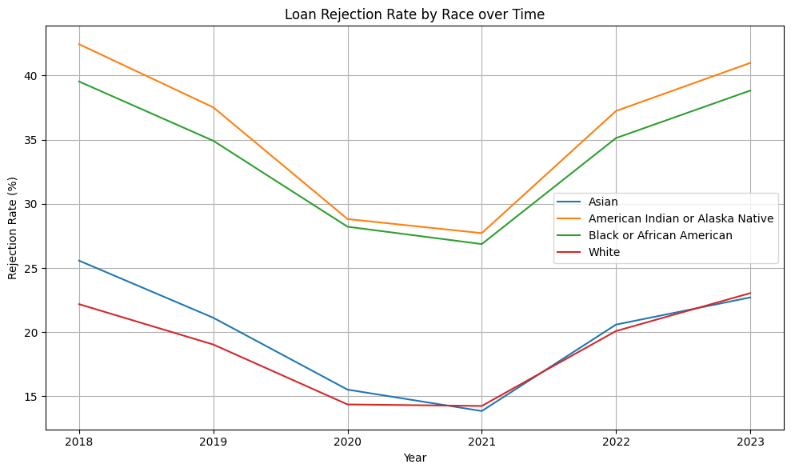

Rejection rates fell from 2018 to 2021 but began rising again after. Throughout, Black and Native applicants face the highest rejection rates. White applicants have the lowest across all years.

### Log of Income Distribution by Race
#### Approved Applicants
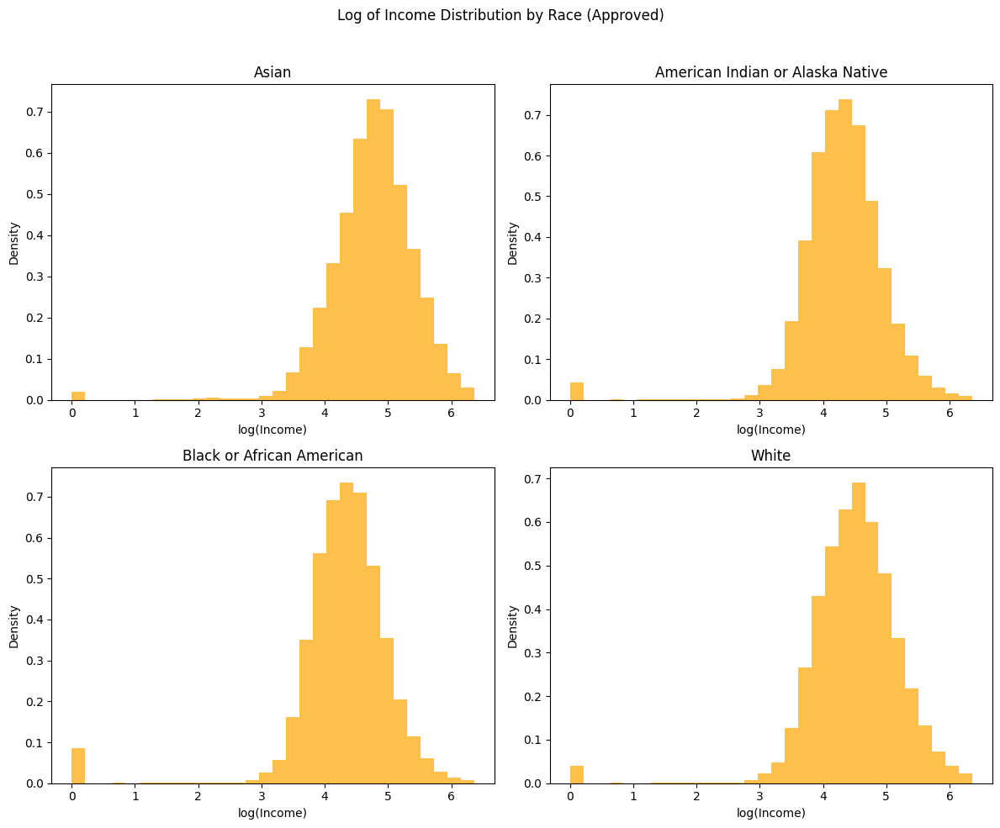
White and Asian applicants are skewed toward higher income brackets. This reflects, in part, both economic status and approval standards.

#### Rejected Applicants
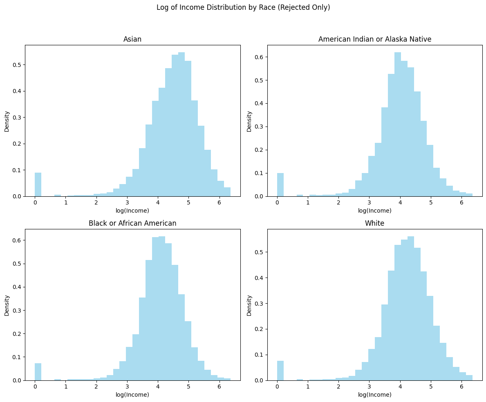
Rejected applicants across all groups show lower incomes, but the effect is especially pronounced among Black and Native applicants.

### Log of Loan Amount Distribution by Race
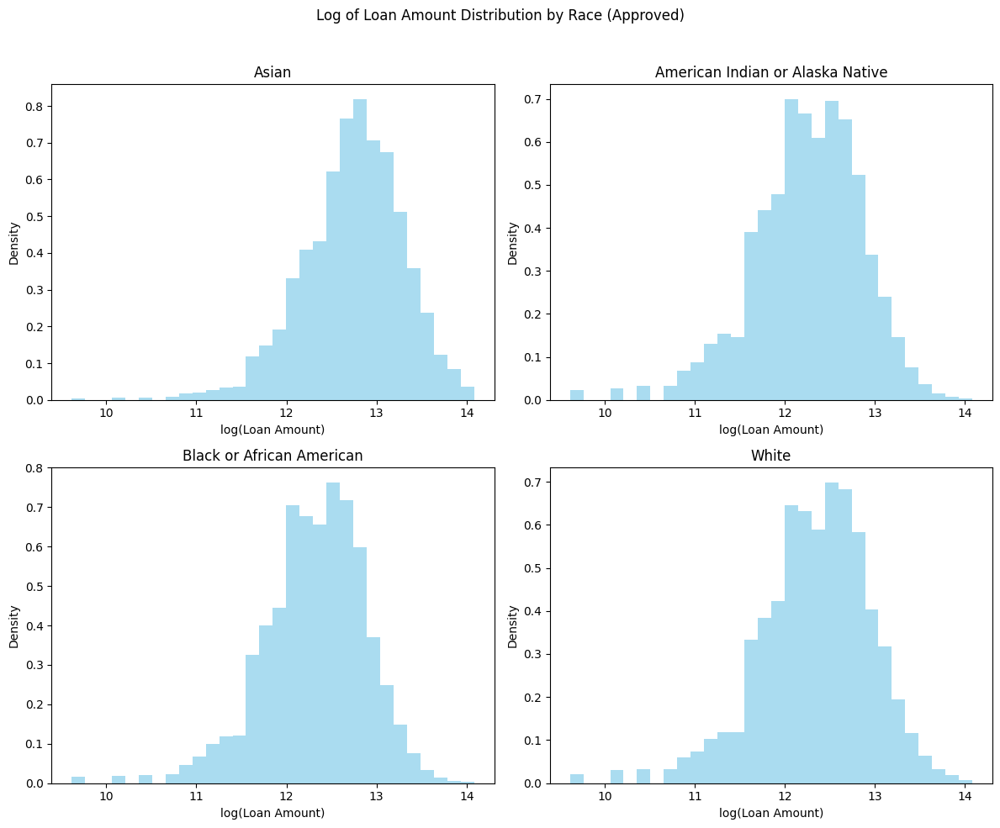
Asian applicants receive the largest loans on average, followed by White borrowers. Native and Black applicants tend to receive smaller loan amounts.

### Log of Property Value Distribution by Race
#### Approved Loans

The distribution shows higher property values among Asian and White borrowers. Black and Native applicants tend to purchase lower-valued properties.

#### Rejected Loans
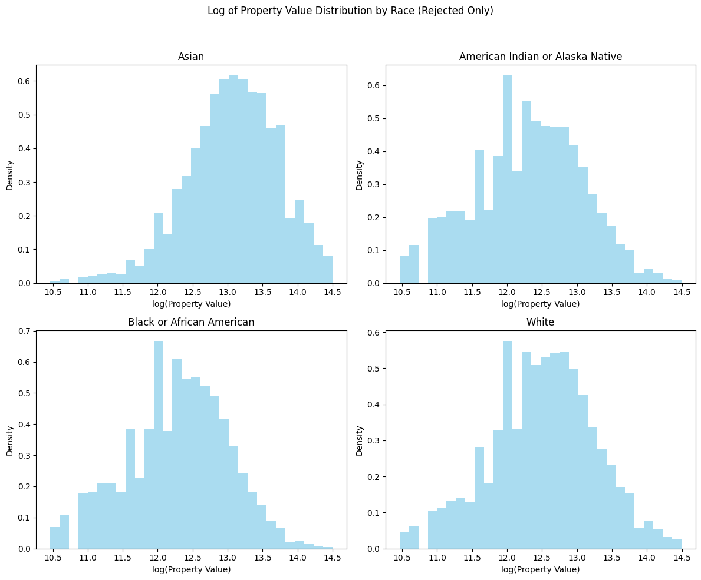
Rejected loans are associated with lower-value properties across all groups, especially among Black and Native Americans.

### Rate Spread Distribution by Race (Approved Only)
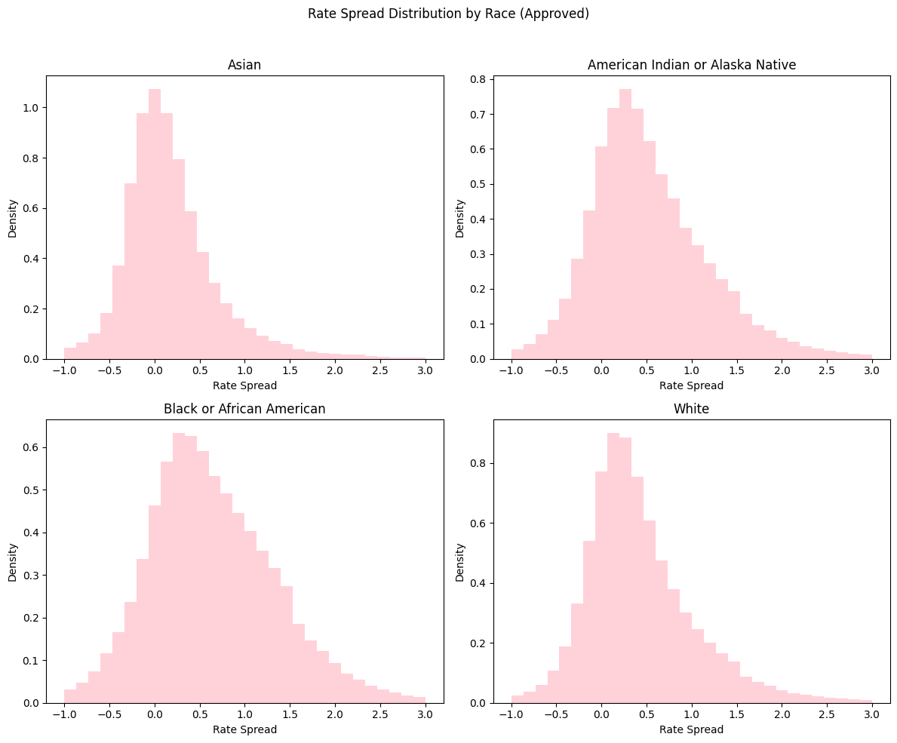
Even among approved loans, rate spreads are higher for Black and Native applicants. This points to disparities not just in access but also in pricing.

### Log of Total Loan Costs by Race (Approved Only)
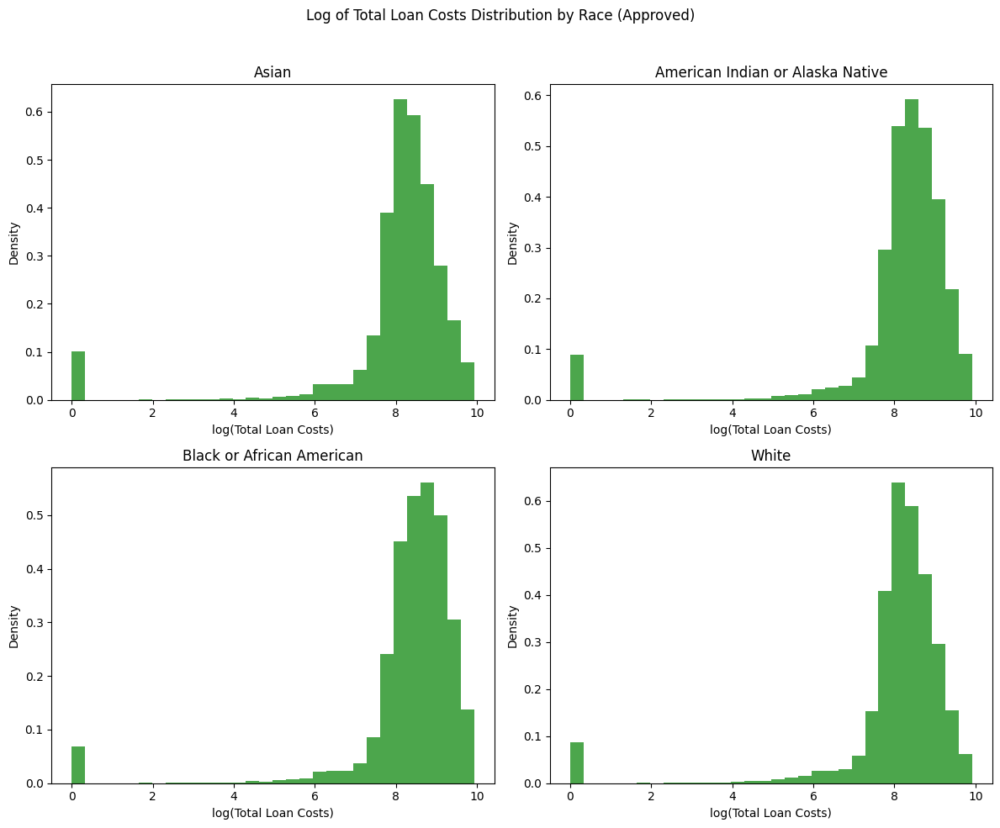
Black and Native borrowers also bear higher overall costs in approved loans. These findings are consistent with structural differences in access and terms.

---

## Modeling

### Logistic Regression (Rejection)
- Binary outcome: approved vs. rejected
- Features: income, age, race, sex, loan amount, property value, LTV, tract income
- AUC ≈ 0.69  
- ROC analysis confirms moderate predictive performance

### Linear Regression (Rate Spread)
- Continuous outcome: rate spread (approved loans only)
- RMSE ≈ 3.58  
- Race coefficients indicate persistent pricing disparities

### Tree-Based Models (Random Forest & GBT)
- Used to predict rate spread and examine feature importance
- Random Forest RMSE: 3.52  
- Gradient Boosted Trees RMSE: 3.43  
- Feature importances highlight income and LTV; race is low-ranked for prediction but impactful in regression

#### Visuals:
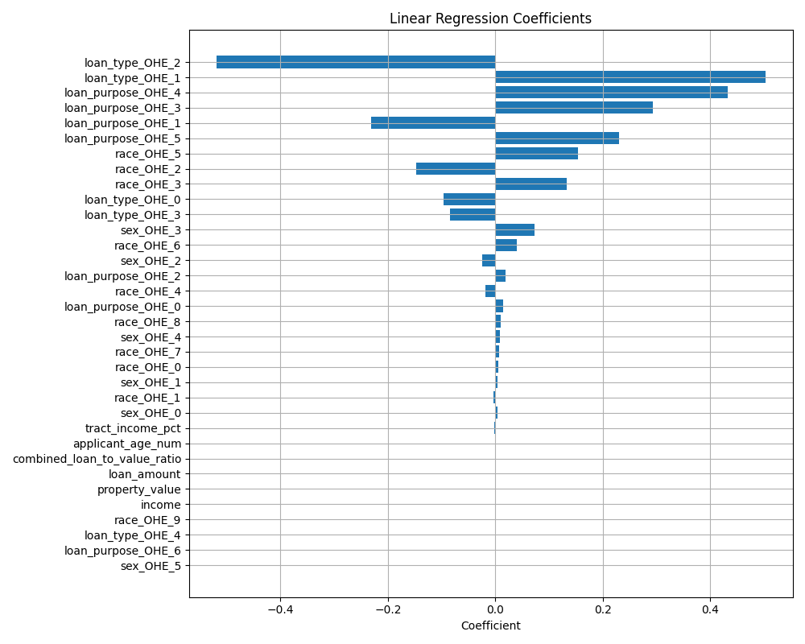
Linear regression reveals that loan type and purpose are primary drivers of pricing. Some race dummies remain non-zero, suggesting residual disparities.

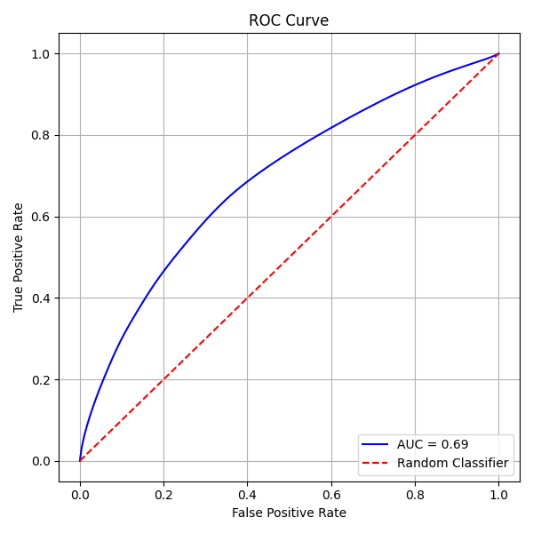
The ROC curve shows the model performs moderately well in classifying rejection decisions. The AUC of 0.69 reflects fair discrimination.

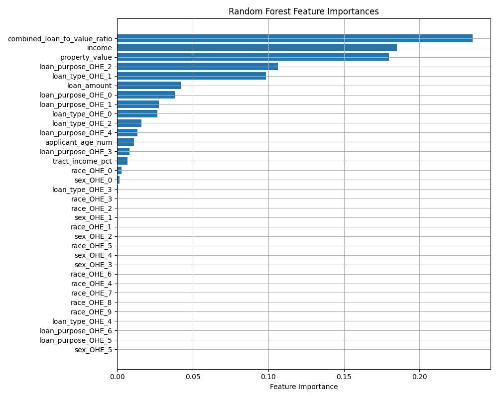
Random Forest models rank `combined_loan_to_value_ratio` and `income` as the most important predictors, consistent with underwriting priorities.

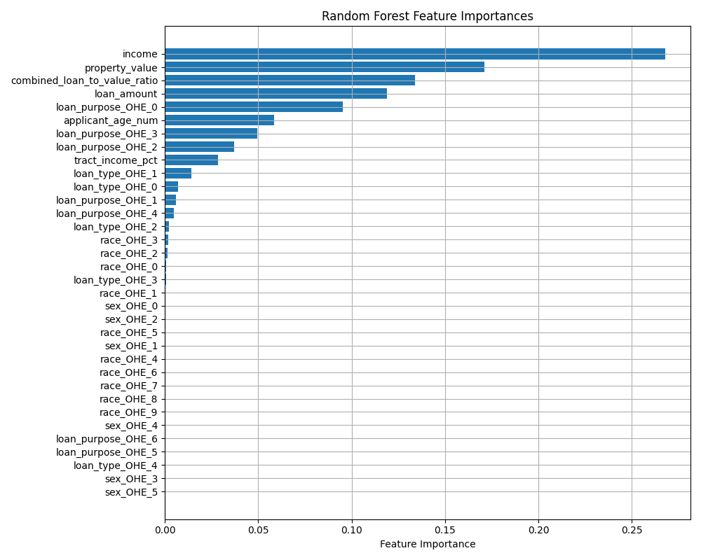
Across different runs, tree models downplay race as a predictor, even as disparities persist. This highlights the tension between prediction and fairness.

---

## Presentation

Slides and visual outputs were built using LaTeX Beamer and exported charts. Visuals correspond directly to analytical sections above.

---

## Google Drive

Data and figures are exported from AWS and stored locally under the `pic/` directory. Final `.parquet` files and Python notebooks are available via private S3 (`nancyfinal/`).

---

## Acknowledgement

Thanks to Professor Jon Clindaniel and the MACS 30123 TA team for their support, and to the University of Chicago Research Computing Center for enabling scalable infrastructure.
